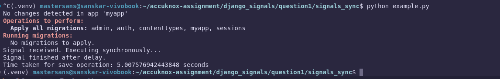
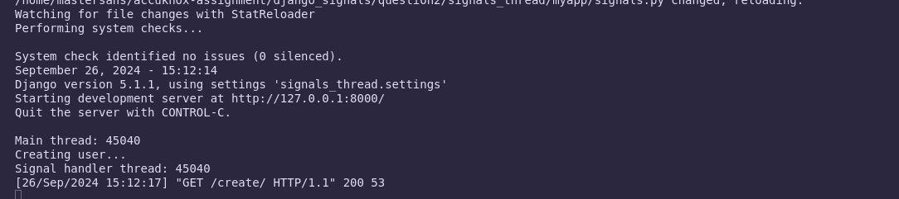
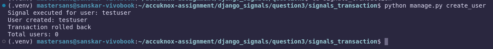

# Accuknox Django Trainee Assignment.

### First of all Thanks for giving me an oppotunity to work on the assignment, lets answer question related to all topic more detailed explaination are in respective markdown file of all different questions


## Topic: Custom Rectange Class.
### `Question1`:
You are tasked with creating a Rectangle class with the following requirements:
- An instance of the Rectangle class requires length:int and width:int to be
initialized.
- We can iterate over an instance of the Rectangle class
- When an instance of the Rectangle class is iterated over, we first get its length in the
format: {'length': <VALUE_OF_LENGTH>} followed by the width {width:
<VALUE_OF_WIDTH>}
### `Answer`: A simple implementation of the rectangle class with given requirements is as shown below but I went ahead and extended the class with addtional functionality and flexiblity.

### you can find the detailed extended class here: [rectange.py](custom_rectangle/rectangle.py)

```python
class Rectangle:
    def __init__(self, length: int, width: int):
        self.length = length
        self.width = width
    
    def __iter__(self):
        yield {'length': self.length}
        yield {'width': self.width}

rect = Rectangle(10, 5)
for dimension in rect:
    print(dimension)
```

## Topic: Django Signals

### `Question1`:
By default are django signals executed synchronously or asynchronously? Please
support your answer with a code snippet that conclusively proves your stance. The code does
not need to be elegant and production ready, we just need to understand your logic.

### `Answer`: By default, Django signals are executed synchronously. When a signal is sent, the receiver functions are called immediately in the order they are connected, blocking the execution of the current thread until all receiver functions have completed.

### If you want to handle signals asynchronously, you would need to implement a task queue or use Django's built-in async capabilities. A simple demonstration is given below and a much detailed code and explanation can be found here: [Question1 Readme File](django_signals/question1/README.md)

```python
import time
from django.db.models.signals import post_save
from django.dispatch import receiver
from django.contrib.auth.models import User

@receiver(post_save, sender=User)
def my_signal_handler(sender, instance, **kwargs):
    print("Signal handler started...")
    time.sleep(3)
    print("Signal handler completed.")

new_user = User.objects.create_user('new_user')
```
### Output:

### `Question2`:
Do django signals run in the same thread as the caller? Please support your
answer with a code snippet that conclusively proves your stance. The code does not need to be
elegant and production ready, we just need to understand your logic.

### `Answer`: Django signals run in the same thread as the caller, meaning that when a signal is sent,the connected receiver functions are executed immediately within the same thread that initiated the action. This synchronous execution ensures that the signal handlers complete their tasks before control returns to the original process, allowing them to access the same context and data without any delay or interruption.

### Below is a simple code to demonstrate is given below, a detail explanation and code can be found here: [Question2 Readme File](django_signals/question2/README.md)

```python
import threading
from django.db.models.signals import post_save
from django.dispatch import receiver
from django.contrib.auth.models import MyModel

@receiver(post_save, sender=MyModel)
def my_signal_handler(sender, instance, **kwargs):
    print(f"Signal handler thread: {threading.current_thread().native_id}")


# views.py
from django.http import JsonResponse
from myapp.models import MyModel
import threading

def create_user(request):
    print(f"Main thread: {threading.current_thread().native_id}")
    print(f"Creating user...")## just to mimic the user creation
    MyModel.objects.create(name="test_user")
    return JsonResponse({"username": "test_user", "message": "User created!"})
```
### Output:

### `Question3`: 

### `Answer`: In Django, signals are executed within the same database transaction as the caller. This means that when a signal is triggered, the associated receiver functions are executed synchronously, ensuring that any changes made during the signal handling are part of the same transaction. If an error occurs and the transaction is rolled back, the changes made by the signal handler are also undone, maintaining data integrity.
### Below is a simple code to demonstrate this behavior, and a detailed explanation can be found here: [Question3 Readme File](django_signals/question3/README.md)

```python
from django.db import transaction
from django.db.models.signals import post_save
from django.dispatch import receiver
from django.contrib.auth.models import User
from django.db import IntegrityError

@receiver(post_save, sender=User)
def user_saved_signal(sender, instance, **kwargs):
    print(f"Signal executed for user: {instance.username}")

# views.py
def create_user(request):
    try:
        with transaction.atomic():
            user = User.objects.create(username="testuser")
            raise IntegrityError("Simulating a rollback")
    except IntegrityError:
        print("Transaction rolled back")
    
    return JsonResponse({"total_users": User.objects.count()})
```
### Output:
